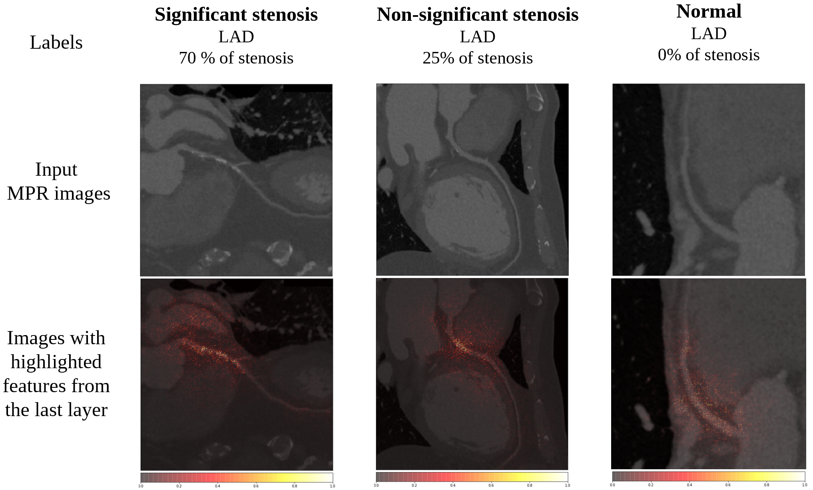
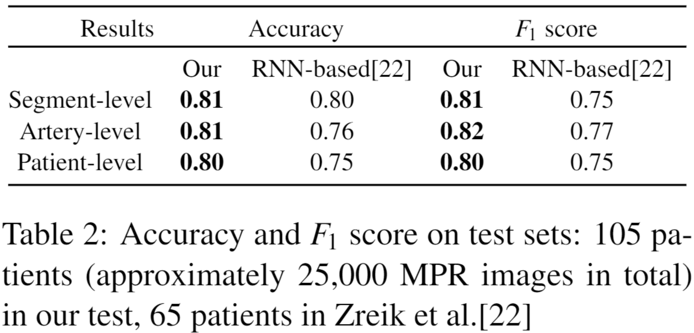
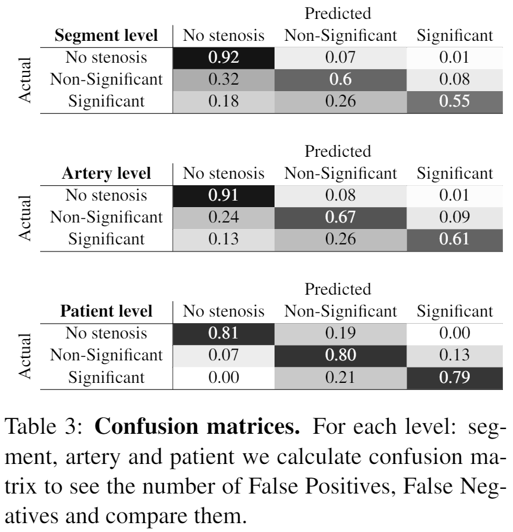

# Coronary Artery Stenosis Level Classification

It is the implementation of the CNN-CASS: CNN for Classification of Coronary Artery Stenosis Score inMPR Images. 

Maria Dobko, Bohdan Petryshak, Oles Dobosevych

In CVWW

## Overview
To decrease patient waiting time for di-agnosis of the Coronary Artery Disease,  automaticmethods are applied to identify its severity in Coro-nary Computed Tomography Angiography scans orextracted  Multiplanar  Reconstruction  (MPR)  im-ages,  giving  doctors  a  second-opinion  on  the  pri-ority of each case.   The main disadvantage of pre-vious  studies  is  the  lack  of  large  set  of  data  thatcould guarantee their reliability.  Another limitationis the usage of handcrafted features requiring man-ual preprocessing, such as centerline extraction.  Weovercome both limitations by applying different au-tomated  approach  based  on  ShuffleNet  V2  networkarchitecture and testing it on the proposed collecteddataset  of  MPR  images,  which  is  bigger  than  anyother  used  in  this  field  before.   We  also  omit  cen-terline extraction step, and train and test our modelusing whole curved MPR images of 708 and 105 pa-tients, respectively.  The model predicts one of threeclasses:  ‘no stenosis’ for normal,  ‘non-significant’— 1-50% of stenosis detected, ‘significant’ — morethan 50% of stenosis.   We demonstrate model’s in-terpretability through visualization of most importantfeatures selected by the network.  For stenosis scoreclassification,  the method showed improved perfor-mance comparing to previous works, achieving 80%accuracy on the patient level. We will make our codepublicly available.


<p align=center>
    
    
</p>

## General Pipeline


## Usage

### Dependencies

All necessary modules are in the requirements.txt
```
pip install -r requirements.txt
```

Also, this code should be compatible with Python versions 2.7-3.5.


### Training
1. Set parameters for the experiment config.yaml (for detailed explanation of the config file see config section below)
2. Run the following command:
```
python train.py
```
### Testing
For the evaluating of the trained models you should use the jupyter notebooks, which are located in the notebooks folder.

## Dataset structure

The dataset has the following structure:

```
|-- RootDir
|     |-- Train
|           |-- labels.csv/.xlsx
|           |-- imgs
|                 |--  patient_1
|                       |-- LAD
|                       |-- RCA
|                       ...
|                 ...
|     |-- Val
|           |-- labels.csv/.xlsx
|           |-- imgs
|                 |--  val_patient_1
|                       |-- LAD
|                       |-- RCA
|                       ...
|                 ...
|     |-- Test
|           |-- labels.csv/.xlsx
|           |-- imgs
|                 |--  test_patient_1
|                       |-- LAD
|                       |-- RCA
|                       ...
|                 ...
|
```

## Config
Our config organized as follows:

1. `experiments_path` - relative or absolute path to output of the TensorBoard.
```
experiments_path: experiments_lenet/

```

2. `device` - device, where to run on. 
```
device: cuda
```

3. `random_state` - fix random seed.
```
random_state: 42
```

4. `dataloader` - parameters for the dataloader class: 
- **batch_size** - size of the batch
- **sampler** - sampler, which balances the classes within epoch(ImbalancedDatasetSampler), or the batch(BalancedBatchSampler) level.
- **accumulation_steps** - amount of the gradient accumulation steps.
```
dataloader:
  batch_size: 16
  sampler: BalancedBatchSampler
  accumulation_steps: 1
```

5. `data` - parameters for the input data:
- **root_dir:** - relative or absolute path to the dataset
- **filters:**
  - **arteries** - arteries, which we want to include into the training process.
  - **viewpoint_index_step** MPR viewpoint index step.
- **groups:**
  - **class_index:** [list of the stenosis score categories, which belongs to this class index]
  - ...
- **augmentation:**
  - **name:** - name of the class, which we want to use for augmentation(LightAug, MediumAugFixed, StrongAugFixed, SafeAug...)
  - **parameters:**
    - **p** - probability of implying the random augmentation techniques for the input images
- **dataset** - dataset class, used for loading the input data(MPR_Dataset, MPR_Dataset_New_Test, MPR_Dataset_LSTM...)
```
data:
  root_dir: data/all_branches_with_pda_plv_with_new_test
  filters:
    arteries: [ 'LAD', 'D-1', 'D-2', 'D-3','PLV_RCA', 'LCX',  'OM-2', 'RCA', 'PLV_LCX', 'OM-3', 'PDA_LCX','OM-1', 'OM' ]
    viewpoint_index_step: 1
  groups:
    0: [ 'NORMAL','-']
    1: ['250%', '<25%', '<35%', '25-50%', '25%', '<50%']
    2: ['50%', '70%','*50%', '50-70%', '70-90%', '90-100%', '>50%', '>70%', '90%', '>90%','75%', '>75%']
  augmentation:
    name: MediumAugFixed
    parameters:
      p: 0.8
  dataset: MPR_Dataset
```

6. `model` - choose the model, which you want for training:
- **name** - name of the model(ShuffleNetv2, ResNet50, ResNet18EfficientB4, EfficientB4, LSTMDeepResNetClassification, AttentionResNet34...)
- **parameters:**
  - **pretrained** - wether backbone pretrained on ImageNet. If you use custom architecture, comment the parameters and pretrained lines.(we will show in the example below)
```
model:
  name: ShuffleNetv2
#  parameters:
#    pretrained: True
```

7. `optimizer` - parameters for the optimizer:
- **name** - name of the optimizer class.(use names of the standart optimizers in PyTorch)
- **parameters:**
  - **lr** - learning rate.
  - **weight_decay** - size of the momentum decay.(uncomment this parameter if needed)
  - **momentum** - momentum size.(uncomment this parameter if needed)
```
  optimizer:  # as in paper
  name:  Adam
  parameters:
    lr: 0.0001
#    weight_decay: 0.00001
#    momentum: 0.9
```
8. `loss` - parameters for the loss function
- **name** - name of the loss class(CrossEntropyLabelSmooth, CrossEntropyLoss, OHEMLoss)
- **parameters:**
    - **num_classes** - number of classes
    - **k** - parameter for OHEMLoss(comment for other classes), top-K elements, the most hard cases in the batch.
```
loss:
  name: CrossEntropyLabelSmooth #CrossEntropyLabelSmooth #CrossEntropyLoss OHEMLoss
  parameters:
     num_classes: 3
#    k: 40
```
## Data & model weights access
For the data and the trained models' weights access request use the following email <petryshak@ucu.edu.ua> 

## Citation

If you use this code for your research, please cite our paper.

```
​```
@InProceedings{DobkoPetryshakDobosevych_2020,
author = {Maria Dobko and Bohdan Petryshak and Oles Dobosevych},
title = {CNN-CASS: CNN for Classification of Coronary Artery Stenosis Score inMPR Images},
booktitle = {The Computer Vision Winter Workshop (CVWW)},
month = {Feb},
year = {2020}
}
​```
```
